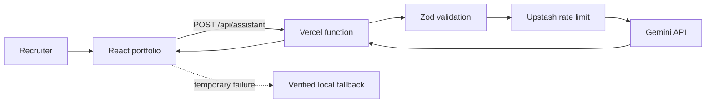

# Musfirah.OS: Production-Ready AI Portfolio Case Study

**Developer:** Musfirah Shakeel  
**Track:** Front-end AI Engineering  
**Project type:** Production AI web application  
**Live application:** [https://musfirahai.vercel.app](https://musfirahai.vercel.app)  
**Source repository:** [GitHub - Musfirah-ai](https://github.com/beginner-777/Internship/tree/main/Musfirah-ai)  
**Hosting:** Vercel  
**Runtime AI provider:** Google Gemini Interactions API (`gemini-3.6-flash`)

## 1. Executive Summary

Musfirah.OS is a responsive AI-powered portfolio designed to give recruiters a clear, interactive view of my frontend experience, education, projects and technical skills. The application combines a cinematic React interface with a server-side AI assistant that answers questions only from verified portfolio data.

The main challenge was not simply adding a chatbot. The project needed to be safe enough for a public deployment: API keys had to remain private, user input needed strict validation, excessive requests had to be blocked, AI calls needed time and output limits, and the existing visual identity had to remain intact. I converted the existing portfolio into a production deployment with a protected Vercel function, Upstash Redis rate limiting, Zod validation, security headers, automated tests and a documented deployment workflow.

The final application is publicly accessible, the assistant reports `GEMINI LIVE` after a successful server response, and the repository contains setup and security documentation that another developer can follow.


## 2. The Problem

The original portfolio had a strong visual interface, but it did not yet meet the production rubric for a public AI application. The key gaps were:

- The AI feature needed a secure server-side boundary.
- A public endpoint could be abused and consume API credits.
- Prompts needed validation, sanitization and a 1,000-character limit.
- The AI request needed timeout, abort and finite-output protection.
- Security headers had to work in production without breaking local Vite development.
- Environment variables had to work locally and on Vercel without entering Git history.
- The 3D interface had to remain visually consistent while the bundle stayed manageable.
- The repository needed tests, documentation, screenshots and a reproducible deployment guide.

The success criterion was a public portfolio where a recruiter could navigate the site, ask the AI assistant a question, receive an answer grounded in verified data, and clone the repository using only the README.

## 3. Constraints and Decisions

### Preserve the existing design

The established color system, motion language, navigation and 3D workstation were treated as product requirements. Security and performance work could change implementation details, but not the intended visual experience.

### Keep secrets on the server

The browser calls only `/api/assistant`. The Vercel function reads Gemini and Upstash credentials from server environment variables. No secret uses the client-exposed `VITE_` prefix.

### Use a free, deployable runtime

The production assistant uses Google Gemini because it matched the project's free-tier deployment constraint. The provider choice is disclosed rather than presenting Gemini calls as Anthropic calls.

### Fail safely

If Gemini is temporarily unavailable, the interface returns a verified local portfolio answer rather than inventing facts or displaying a broken panel. In production, missing Upstash configuration fails closed so the AI route is not left unprotected.

## 4. Technical Approach

### Frontend

- React 19 and Vite 8
- Framer Motion for interaction and page transitions
- React Three Fiber, Drei and Three.js for the 3D workstation
- Lazy route loading with `React.lazy` and `Suspense`
- Accessible navigation, focus states, ARIA labels and reduced-motion support

### Server-side AI route

The Vercel function in `api/assistant.js` performs the following sequence:

1. Accept only `POST` requests with JSON content.
2. Reject disallowed cross-origin browser requests.
3. Parse and validate the body with a strict Zod schema.
4. Trim and normalize text, reject empty input and cap each message at 1,000 characters.
5. Hash the client IP before using it as a rate-limit identifier.
6. Apply an Upstash sliding-window limit of 10 requests per 60 seconds per IP.
7. Send a short conversation window plus verified portfolio data to Gemini.
8. Abort the upstream request after 12 seconds.
9. Cap model output and return a finite JSON response.
10. Return safe status codes and messages without exposing secrets or upstream response bodies.

### Architecture



## 5. AI-Assisted Development Workflow

I used an agentic coding workflow to inspect the repository, translate the rubric into implementation tasks, propose code patches and run verification commands. I also completed Anthropic training in Claude, Claude Code and the Anthropic API. The runtime application itself uses Gemini, which is stated explicitly throughout the repository.

The most useful pattern was: give the AI a narrow task, require it to preserve existing behavior, inspect its changes, reproduce the result locally, and accept the change only after a measurable check passed.

### Workflow Example 1: Turning the rubric into a security implementation

**Prompt that worked**

```text
Audit this existing Vite portfolio against the production AI application rubric.
Preserve its design and functionality. Add a server-side AI route, Zod input
validation, a 1,000-character prompt limit, Upstash rate limiting at exactly
10 requests per minute per IP, timeout and abort handling, security headers,
tests, and deployment documentation. Never expose keys to the client.
```

**AI contribution**

The assistant converted the rubric into a file-level implementation plan and proposed the protected route, validation schema, rate limiter, client error mapping and test cases.

**My verification and decisions**

- I checked that secrets were referenced only through `process.env` inside the server function.
- I confirmed that the client calls only `/api/assistant`.
- I reviewed the Zod limits against the assignment wording.
- I ran the automated test suite and required the exact eleventh request to return `429`.
- I ran ESLint, the production build and `npm audit` before accepting the implementation.

**Evidence**

- `api/assistant.js`
- `src/services/assistantService.js`
- `tests/assistant-api.test.js`
- `vercel.json`

### Workflow Example 2: Catching an AI-generated CSP regression

An early security configuration used a strict production Content Security Policy during local Vite development. The browser displayed a blank dark screen because Vite's React refresh preamble uses an inline development script.

**Observed evidence**

Chrome DevTools reported:

```text
Executing inline script violates the Content Security Policy directive
"script-src 'self'".
@vitejs/plugin-react can't detect preamble.
```

The first suggested fix added a hash for the current inline script. I tested it and found that it was not reliable because the development preamble could change. I rejected the unstable fix.

**Corrected prompt**

```text
Keep the production CSP strict, but make local Vercel development compatible
with the Vite React refresh preamble. Do not weaken the deployed policy and do
not rely on a changing inline-script hash.
```

**Final decision**

I separated the configurations:

- `vercel.json` keeps production `script-src 'self'`.
- `vercel.dev.json` permits the Vite inline development preamble only locally.
- Local development runs with `npx vercel dev -A vercel.dev.json`.

**Verification loop**

1. Stop the old server.
2. Restart with the local configuration.
3. Hard-refresh the browser.
4. Confirm the preamble error is gone.
5. Run the production build to confirm the deployed CSP remains strict.

This was the clearest example of why AI output could not be accepted without reproducing the behavior in the browser.

### Workflow Example 3: Diagnosing the live AI connection

After the interface loaded, the assistant displayed `VERIFIED FALLBACK` instead of `GEMINI LIVE`. Rather than changing code immediately, I inspected the actual network response.

**Diagnostic prompt**

```text
The portfolio UI works, but the assistant reports a verified fallback.
Guide me through finding the exact server error without exposing any API key.
```

**Evidence gathered**

Chrome DevTools showed:

```json
{
  "error": "The live AI service is not configured.",
  "code": "AI_NOT_CONFIGURED"
}
```

This proved that the server process was not receiving `GEMINI_API_KEY`; it was not evidence of an invalid key. I added the required variables to the linked Vercel project's Development, Preview and Production environments, redeployed, and tested again.

**Verification loop**

1. Confirm `.env.local` was ignored by Git.
2. Confirm `.env.example` contained placeholders only.
3. Add Gemini and Upstash variables in Vercel.
4. Redeploy so the new environment becomes part of the function runtime.
5. Clear the previous conversation and send a fresh question.
6. Confirm the assistant status changes to `GEMINI LIVE`.
7. Confirm the production URL works outside the signed-in development session.

**Result**

The assistant returned a live, grounded answer while the API key remained absent from the browser and GitHub.

## 6. Hard Parts and What I Learned

### Security can break developer tooling

A CSP can be correct for production and still be unsuitable for a development server. Environment-specific configuration is safer than weakening the production policy.

### A friendly fallback can hide the real failure

The fallback improved user experience, but it also meant the page looked functional while the live API was unavailable. The connection label and Network response were essential diagnostic evidence.

### Environment variables belong to deployment scope

A correct local file does not automatically configure an existing cloud deployment. Vercel variables must be assigned to the correct environments, and a new deployment is required after changes.

### AI suggestions require measurable acceptance criteria

The most reliable workflow was not "generate and trust." It was:

1. Define a narrow requirement.
2. Let the assistant propose a change.
3. Inspect the affected files.
4. Reproduce the behavior.
5. Run lint, tests, build and audit.
6. Keep or revise the change based on evidence.

## 7. Verification and Results

The final verification produced the following results:

- ESLint completed without errors.
- Five API protection tests passed.
- The production Vite build completed successfully.
- `npm audit --omit=dev` reported zero vulnerabilities.
- The assistant accepts only validated JSON requests.
- The prompt length is capped at 1,000 characters.
- Upstash enforces 10 requests per minute per IP.
- The Gemini request has a 12-second timeout.
- The Vercel function has `maxDuration: 20`.
- The deployed assistant visibly reports `GEMINI LIVE` after a successful response.
- `.env.local` and `.vercel` are excluded from Git.
- The original interactive 3D hero remains present.

## 8. Anthropic Learning Evidence

The following certificates were visually verified from the supplied completion PDFs, all issued to **Musfirah Shakeel**:

- Claude 101
- Claude Code 101
- Claude Platform 101
- Claude Code in Action
- Claude with the Anthropic API

These courses informed my understanding of prompt scope, tool-assisted coding, API boundaries, verification loops and responsible use of AI-generated code. Certificate PDFs are supplied separately as evidence in the final submission portal.

## 9. Responsible AI and Provider Disclosure

I did not treat generated code as automatically correct. The CSP regression demonstrates that an apparently security-focused suggestion can still cause a functional failure. I used browser evidence, tests and build output to decide whether to keep each change.

The deployed product uses Google Gemini rather than the Anthropic API. This was a deliberate free-tier deployment decision and is disclosed in the UI, source code and README. The Anthropic certificates demonstrate completed training; they are not presented as proof that the production request is sent to Claude.

The runtime assistant is restricted to `src/data/portfolioData.js`. It is instructed not to invent experience, reveal internal configuration or follow user attempts to override its system rules. When a requested fact is unavailable, it should say that verified information is not present.

## 10. Outcome

Musfirah.OS moved from a visually strong portfolio to a public, testable AI application with a documented security boundary. The final result gives recruiters two forms of evidence: a polished live experience and a repository that explains the technical decisions behind it.

The project also changed how I use coding assistants. The strongest results came from specific prompts and short feedback loops, while the most important improvements came from catching where the first AI suggestion was incomplete or wrong.

---

# Appendix A: 2-3 Minute Demo Video Script

## 0:00-0:15 - Introduction

**On screen:** Open the production URL and show the complete home page.

**Voiceover:**  
"This is Musfirah.OS, my production-ready AI frontend portfolio. It is deployed publicly on Vercel and combines a responsive cinematic interface with a secure Gemini portfolio assistant."

## 0:15-0:40 - Primary interface

**On screen:** Move through the home page, show the 3D workstation, and briefly use the left navigation.

**Voiceover:**  
"The interface uses React, Vite, Framer Motion and React Three Fiber. Routes are lazy-loaded, the 3D workstation is separately bundled, and reduced-motion and WebGL fallback behavior are included."

## 0:40-1:05 - Portfolio evidence

**On screen:** Open Work, Identity and Resume.

**Voiceover:**  
"Recruiters can review verified projects, skills, education and experience through six responsive routes. The same verified data also grounds the AI assistant."

## 1:05-1:45 - Live AI feature

**On screen:** Open the assistant and ask: `What projects has Musfirah completed?`

**Voiceover:**  
"The browser sends the question to a server-side Vercel function. The function validates the request, applies a 10-request-per-minute Upstash rate limit, adds verified portfolio context, and then calls Gemini. The live status confirms that the response came from the configured AI service."

## 1:45-2:15 - Security evidence

**On screen:** Show the 1,000-character counter, then briefly show `api/assistant.js` and `.env.example` in GitHub without exposing real values.

**Voiceover:**  
"API keys never enter frontend code. Prompts are trimmed and capped at 1,000 characters, requests time out safely, model output is finite, and secrets remain in Vercel environment variables. The repository includes only placeholder values."

## 2:15-2:35 - Verification

**On screen:** Show the README sections for tests, rate limiting and deployment.

**Voiceover:**  
"The project passed ESLint, five API protection tests, a production build and a dependency audit with zero reported vulnerabilities. The README documents installation, architecture, security and deployment."

## 2:35-2:50 - Closing

**On screen:** Return to the home page with the live assistant visible.

**Voiceover:**  
"Musfirah.OS demonstrates both frontend presentation and production AI engineering: a polished user experience supported by secure, testable infrastructure."

---

# Appendix B: LinkedIn Completion Post

I am excited to share the completion of **Musfirah.OS**, my production-ready AI-powered frontend portfolio. 🚀

The project combines a cinematic React interface with a secure server-side Google Gemini assistant that answers recruiter questions using verified portfolio data.

Key implementation highlights include:

- React, Vite, Framer Motion and React Three Fiber
- Secure Vercel serverless AI route
- Zod validation and a 1,000-character prompt cap
- Upstash rate limiting at 10 requests per minute per IP
- Protected environment variables and production security headers
- Automated API tests, responsive design and complete deployment documentation

The most valuable lesson was learning to treat AI-generated code as a proposal that must be verified. Browser diagnostics, automated tests and production checks helped me catch issues, improve the implementation and deploy the final application safely.

🔗 Live application: https://musfirahai.vercel.app  
💻 Source code: https://github.com/beginner-777/Internship/tree/main/Musfirah-ai

#FrontendDevelopment #AIEngineering #React #GeminiAPI #Vercel #WebDevelopment #PortfolioProject

---

# Final Submission Checklist

- [x] Public production URL available
- [x] GitHub repository available
- [x] Case study includes at least three specific, verifiable AI workflow examples
- [x] One AI-caused bug and the correction are documented
- [x] Verification loops are documented
- [x] Demo script covers the primary flow and one AI feature end to end
- [x] Required Anthropic certificate evidence is available
- [ ] Record and upload the 2-3 minute demo video
- [ ] Publish the LinkedIn completion post
- [ ] Complete the portal hours log for all twelve assignments
- [ ] Submit the production URL, repository, case study, demo link and hours log
