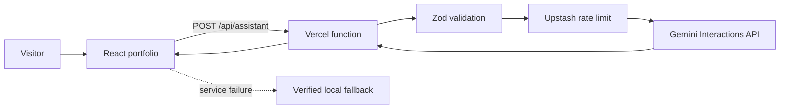

# Musfirah.OS — AI-powered frontend portfolio

Musfirah.OS is a production-ready portfolio experience for Musfirah Shakeel. It combines a cinematic React interface with a server-side Google Gemini assistant that answers questions only from verified portfolio data.

**Production:** Add the new public Vercel URL after deployment.

## Screenshots

Production screenshots should be added to `docs/screenshots/` immediately after the new Vercel deployment. The previous deployment URL currently returns `DEPLOYMENT_NOT_FOUND`, so an old or fabricated screenshot is intentionally not included.

## Features

- Six responsive portfolio routes: Command, Identity, Work, AI Lab, Resume and Contact
- Google Gemini 3.6 Flash assistant grounded in structured portfolio data
- Server-only API key and stateless Gemini requests with `store: false`
- Distributed Upstash rate limiting: 10 AI requests per minute per hashed IP
- Zod validation, whitespace normalization and a 1,000-character prompt cap
- Same-origin enforcement, restrictive security headers and Content Security Policy
- A 12-second upstream timeout, 20-second function `maxDuration` and finite output limits
- Friendly 429, validation, timeout and service-unavailable messages
- Deterministic portfolio fallback when Gemini is temporarily unavailable
- Lazy-loaded routes and an idle-loaded Three.js workstation
- Lightweight 3D fallback for mobile, reduced-motion and data-saver users
- Error boundary, custom 404 route, route loaders and reduced-motion support
- Accessible labels, keyboard navigation, semantic landmarks and touch-safe controls

## Technology

| Layer | Technology |
| --- | --- |
| Frontend | React 19, Vite 8, lightweight History API router |
| Styling | Tailwind CSS 4 pipeline and custom responsive CSS |
| Motion and 3D | Framer Motion, React Three Fiber, Drei, Three.js |
| AI | Google Gemini Interactions API, `gemini-3.6-flash` |
| Validation | Zod |
| Rate limiting | Upstash Redis and `@upstash/ratelimit` |
| Hosting | Vercel static deployment and Node.js serverless function |
| Quality | ESLint and Node test runner |

## Architecture



The browser never receives the Gemini or Upstash credentials. It sends a short conversation window to the Vercel function. The function validates and normalizes the request, checks the distributed rate limit, adds the verified portfolio system instruction, and then calls Gemini.

Gemini storage is disabled. The application sends at most eight messages, limits each message to 1,000 characters, caps the model response, and renders returned text through React rather than injecting HTML.

### Key architecture decision

This checkpoint productionizes the existing Vite capstone instead of rewriting its established interface in another framework. The security boundary remains server-side through a Vercel function, while the existing visual design, routes and Three.js experience remain intact. A small History API router covers the six static portfolio routes without shipping a vulnerable or unnecessary routing dependency.

## Folder structure

```text
Musfirah-ai/
├── api/
│   └── assistant.js              # Protected Gemini serverless endpoint
├── public/
│   ├── resume/                   # Downloadable resume
│   ├── robots.txt
│   └── sitemap.xml
├── src/
│   ├── components/               # Shared UI, assistant, loaders and 3D views
│   ├── constants/                # Shared client limits
│   ├── context/                  # Application state
│   ├── data/                     # Verified portfolio facts and prompt suggestions
│   ├── hooks/                    # Reusable browser behavior
│   ├── pages/                    # Lazy-loaded routes and 404 page
│   ├── routing/                  # Small History API router
│   ├── services/                 # Browser API client
│   └── utils/                    # Deterministic assistant fallback
├── tests/
│   └── assistant-api.test.js     # Validation, origin, secrecy and rate-limit tests
├── .env.example
├── vercel.json                   # Function duration, headers and SPA rewrites
└── vite.config.js                # Production bundling and code splitting
```

## Local installation

### Requirements

- Node.js 20.19 or newer
- npm
- A [Google AI Studio API key](https://aistudio.google.com/app/apikey)
- An [Upstash Redis database](https://console.upstash.com/)
- Vercel CLI for full local API testing

### 1. Install dependencies

```bash
git clone <your-repository-url>
cd Musfirah-ai
npm install
```

### 2. Configure local variables

Copy `.env.example` to `.env.local` and insert your own values:

```env
GEMINI_API_KEY=your_server_side_gemini_key
GEMINI_MODEL=gemini-3.6-flash
UPSTASH_REDIS_REST_URL=your_upstash_rest_url
UPSTASH_REDIS_REST_TOKEN=your_upstash_rest_token
APP_ORIGIN=http://localhost:3000
```

Never prefix a secret with `VITE_`. Vite exposes variables with that prefix to browser code.

### 3. Start the application

For frontend-only development with the verified local fallback:

```bash
npm run dev
```

For the real Vercel function and Gemini integration:

```bash
npx vercel dev
```

Open the URL printed by the selected command.

## Environment variables

| Variable | Required | Scope | Purpose |
| --- | --- | --- | --- |
| `GEMINI_API_KEY` | Yes | Server only | Authenticates the Gemini request |
| `GEMINI_MODEL` | No | Server only | Overrides the default `gemini-3.6-flash` model |
| `UPSTASH_REDIS_REST_URL` | Yes | Server only | Upstash Redis REST endpoint |
| `UPSTASH_REDIS_REST_TOKEN` | Yes | Server only | Upstash Redis REST credential |
| `APP_ORIGIN` | Recommended | Server only | Additional canonical origin allowed to call the API |

`.env.local`, `.vercel`, generated builds and local files are ignored by Git. `.env.example` contains placeholders only.

## API

### `POST /api/assistant`

Request:

```json
{
  "messages": [
    {
      "role": "user",
      "content": "What frontend projects has Musfirah completed?"
    }
  ]
}
```

Successful response:

```json
{
  "answer": "A concise response grounded in verified portfolio data.",
  "source": "gemini",
  "model": "gemini-3.6-flash",
  "requestId": "request-correlation-id"
}
```

Important status codes:

| Status | Meaning |
| --- | --- |
| `200` | Verified Gemini answer returned |
| `400` | Invalid JSON structure, empty prompt or validation failure |
| `403` | Disallowed browser origin |
| `405` | Method other than POST |
| `413` | Request body exceeds the safe body limit |
| `415` | Content type is not JSON |
| `429` | Per-IP request limit exceeded |
| `502` | Gemini network or upstream response failure |
| `503` | AI or distributed rate limiting is unavailable |
| `504` | Gemini request exceeded the internal timeout |

## Security and API protection

### Secret protection

- Gemini and Upstash credentials are read only inside `api/assistant.js`.
- No secret uses the client-exposed `VITE_` prefix.
- Responses and development-safe logs never contain keys or upstream response bodies.
- The final source package excludes `.env.local` and `.vercel` files.

### Input protection

- Zod accepts only a strict `{ messages }` object.
- Roles are restricted to `user` and `assistant`.
- Empty prompts, unknown fields and histories longer than eight messages are rejected.
- Each message is trimmed, normalized and limited to 1,000 characters.
- Control characters and oversized bodies are rejected or normalized before Gemini receives them.
- The system instruction treats conversation content as untrusted data and refuses instruction disclosure.

### Rate limiting

`@upstash/ratelimit` uses a sliding window of 10 requests per 60 seconds. The client IP is SHA-256 hashed before it becomes the Redis identifier. A blocked request receives HTTP `429`, `Retry-After` and rate-limit headers.

Production fails closed when Upstash is missing or unavailable, preventing an unprotected AI route from silently consuming credits. Local development uses a process-local limiter only when `NODE_ENV` is not `production`.

### Streaming and duration safety

The endpoint intentionally returns one finite JSON response rather than an open-ended stream. It still applies streaming-equivalent safeguards:

- Gemini fetch timeout: 12 seconds
- Vercel function `maxDuration`: 20 seconds
- Gemini output cap: 240 tokens
- Returned answer cap: 4,000 characters
- Client request abortion when the assistant closes, resets or unmounts
- Gemini request abortion when the client connection is aborted

### Browser and application security

- Same-origin and `Sec-Fetch-Site` checks limit browser abuse and provide CSRF-equivalent protection for this unauthenticated, cookie-free endpoint.
- Content Security Policy restricts scripts, connections, frames and object embedding.
- HSTS, `nosniff`, frame denial, referrer and permissions policies are set in `vercel.json`.
- React escapes assistant text, and the app never renders model output as HTML.
- A root error boundary and custom 404 route provide safe recovery paths.
- Authentication and cookies are not used, so secure-cookie configuration is not applicable.

## Performance strategy

- Every route is loaded with `React.lazy` and `Suspense`.
- The Three.js scene is a separate chunk and loads only during desktop browser idle time.
- Mobile, reduced-motion and data-saver users receive a lightweight CSS workstation.
- Vite separates Three.js and Framer Motion into cacheable chunks.
- Local font files prevent third-party render-blocking font requests.
- Production source maps are disabled and assets are minified.
- The resume is served as a static file.

## Accessibility and browser support

The interface targets current Chrome, Firefox, Safari, Edge, Mobile Safari and Android Chrome. It uses semantic navigation, visible focus behavior, screen-reader labels, a skip link, polite live regions, touch-safe buttons and reduced-motion detection. WebGL failure automatically falls back to a CSS-rendered workstation instead of showing a blank screen.

Before submission, verify the production URL on at least one desktop Chromium browser, Firefox, Safari or Mobile Safari, and Android Chrome. Confirm navigation, assistant submission, 429 feedback, resume download and layout behavior at 375 px and 1440 px widths.

## Quality commands

```bash
npm run lint      # ESLint
npm test          # API protection tests
npm run build     # Optimized Vite build
npm run check     # Lint, tests and build
```

The automated API tests verify method restriction, cross-origin rejection, empty and oversized prompt validation, successful Gemini response handling, secret non-disclosure and the exact 10-request rate limit.

## Deploy to Vercel

1. Push this source to a clean GitHub repository.
2. Import the repository from the Vercel dashboard.
3. Keep the detected framework as **Vite** and the output directory as `dist`.
4. Add all required environment variables under **Settings → Environment Variables** for Production and Preview.
5. Use a fresh Gemini key. Do not reuse a key that was previously included in a ZIP or commit.
6. Deploy, then open the production URL and test the assistant.
7. If environment variables are added after the first deployment, use **Deployments → Redeploy**.

The repository includes `vercel.json`, so SPA routes, security headers and function duration are configured automatically.

## Production checklist

- [ ] Fresh Gemini key configured in Vercel
- [ ] Upstash REST URL and token configured in Vercel
- [ ] `.env.local` and `.vercel` absent from Git history
- [ ] `npm run check` passes
- [ ] All routes work after a hard refresh
- [ ] Gemini assistant returns a verified answer
- [ ] The eleventh request from one IP returns HTTP 429
- [ ] Chrome, Firefox, Edge and mobile layouts checked
- [ ] Production URL is publicly accessible
- [ ] README screenshots and deployment URL are current

## How AI tools were used to build this

AI coding assistance was used to audit the existing capstone against the production rubric, identify abuse cases, draft the Zod schema, refine the Upstash sliding-window implementation, propose security headers, add API tests and organize this documentation. The existing portfolio design, verified personal data, project descriptions and final product decisions were preserved and reviewed by the developer. Automated suggestions were accepted only after linting, tests and a production build passed.

Google Gemini is also a runtime product feature. It does not create portfolio facts; it retrieves and explains facts from `src/data/portfolioData.js` under a restrictive system instruction. A deterministic local engine keeps verified answers available when Gemini cannot be reached.

## Future improvements

- Add CI checks for every pull request
- Add Playwright coverage for keyboard and mobile navigation
- Add privacy-preserving production observability and alerting
- Add localized assistant UI copy
- Add an automated accessibility audit to the release workflow
- Add a custom domain and social sharing image

## License

This project is released under the [MIT License](LICENSE).
