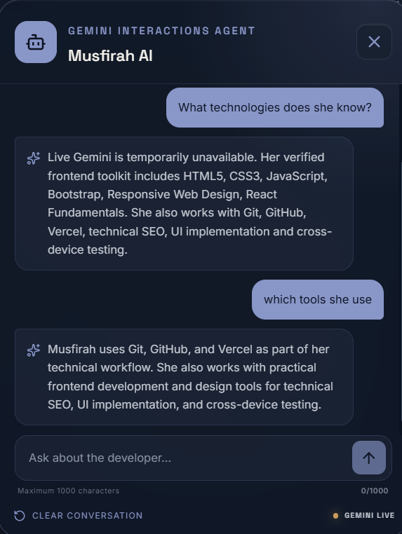

# Musfirah.OS — AI-powered frontend portfolio

## Project Overview

Musfirah.OS is a production-ready AI-powered portfolio for Musfirah Shakeel. It combines a cinematic, responsive React interface with a secure server-side Google Gemini assistant that answers recruiter questions using only verified portfolio data.

- **Live Application:** [https://musfirahai.vercel.app](https://musfirahai.vercel.app)
- **Source Code:** [GitHub Repository](https://github.com/beginner-777/Internship/tree/main/Musfirah-ai)
- **Deployment:** Vercel
- **Status:** Production Ready

## Screenshots

### Desktop Portfolio with Live Gemini Assistant

